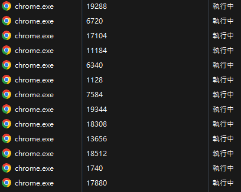
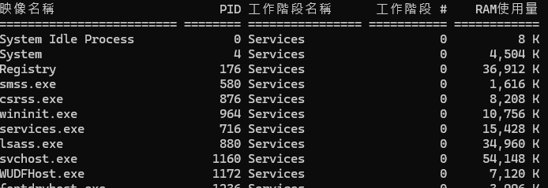
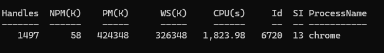
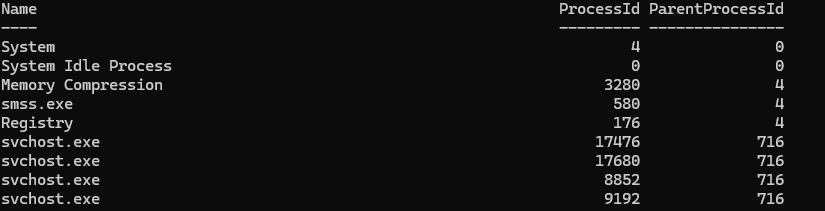

# Tryhackme_0727

## 什麼是 PID？

**PID** 是 **Process ID** 的縮寫，中文通常稱為：

> 處理程序識別碼

當一個程式在作業系統中執行時，作業系統會為它建立一個 **Process（處理程序）**，並分配一個獨立的數字作為 PID。

例如：

| 處理程序 | PID |
| -------------- | ---: |
| `chrome.exe` | 4520 |
| `discord.exe` | 7864 |
| `explorer.exe` | 2180 |
| `node.exe` | 9352 |

作業系統可以利用 PID 分辨不同的處理程序。

---

## 程式和處理程序的差別

程式和處理程序並不完全相同。

 **Program（程式）**：儲存在硬碟中的程式檔案。
  **Process（處理程序）**：程式被啟動後，在記憶體中執行的實體。

例如，`chrome.exe` 是一個程式。

當使用者開啟 Chrome 時，作業系統會建立一個或多個 Chrome 處理程序，並為每個處理程序分配不同的 PID。

```text
chrome.exe → PID 19288
chrome.exe → PID 6720
chrome.exe → PID 17104
```

Chrome 可能會為不同的分頁、擴充功能或背景服務建立不同的處理程序，因此工作管理員中可能會看到多個 `chrome.exe`。



---

## PID 的特性

### 每個執行中的處理程序都有 PID

只要程式正在執行，通常就會有自己的 PID。

### PID 在同一時間不會重複

在同一個作業系統環境中，同一時間不會有兩個執行中的處理程序使用完全相同的 PID。

### PID 不是永久固定的

程式關閉後，原本的 PID 就會失效。

下次重新啟動程式時，通常會取得新的 PID。

```text
第一次開啟 Chrome：PID 4520
第二次開啟 Chrome：PID 8176
```

### PID 可能會被重複使用

當某個處理程序結束後，它的 PID 未來可能會被作業系統分配給其他處理程序。

因此，在資安調查中不能只根據 PID 判斷程式身分，還需要搭配其他資訊。

---

## 如何查看 PID？

## Windows 工作管理員

可以透過以下步驟查看 PID：

1. 開啟「工作管理員」。
2. 切換到「詳細資料」頁面。
3. 找到 `PID` 欄位。

如果沒有看到 PID 欄位，可以在欄位標題上按右鍵，選擇要顯示的欄位。

---

## Windows CMD

在命令提示字元中輸入：

```cmd
tasklist
```

輸出可能如下：


其中的 `PID` 欄位就是每個處理程序的識別碼。

---

## Windows PowerShell

可以使用：

```powershell
Get-Process
```

查詢特定 PID：

```powershell
Get-Process -Id 6720
```



---

## Linux

可以使用：

```bash
ps
```

查看完整處理程序：

```bash
ps aux
```

也可以使用：

```bash
top
```

或：

```bash
htop
```

來即時觀察處理程序與系統資源使用情況。

---

## PID 的實際應用

### 結束無回應的程式

當程式當機或無法正常關閉時，可以利用 PID 結束特定處理程序。

Windows：

```cmd
taskkill /PID 13508 /F
```


參數說明：

* `/PID 13508`：指定要結束的處理程序。
* `/F`：強制結束。

Linux：

```bash
kill 4520
```

強制結束：

```bash
kill -9 4520
```

使用強制結束時要小心，因為程式可能沒有機會儲存資料或正常釋放資源。

---

## 查看 CPU 和記憶體使用量

PID 可以用來指定要觀察的處理程序。

Windows PowerShell：

```powershell
Get-Process -Id 6720
```


Linux：

```bash
ps -p 6720
```

即時查看：

```bash
top -p 6720
```

這些工具可以查看：

| 欄位 | 意思 |
| --------------- | ------------------------------------------- |
| **Handles** | 程序目前開啟的「控制代碼」數量，例如檔案、視窗、登錄檔、執行緒等資源 |
| **NPM(K)** | **Non-Paged Memory**，不可被移到硬碟分頁檔的核心記憶體，單位 KB |
| **PM(K)** | **Paged Memory**，可被移到分頁檔的記憶體，單位 KB |
| **WS(K)** | **Working Set**，目前實際放在實體 RAM 中的記憶體，單位 KB |
| **CPU(s)** | 這個程序啟動後累積使用的 CPU 時間，單位是秒，**不是目前 CPU 使用率** |
| **Id** | Process ID，也就是程序的唯一編號，簡稱 PID |
| **SI** | Session ID，表示程序屬於哪個 Windows 登入工作階段 |
| **ProcessName** | 程序名稱 |

---

## 找出占用 Port 的程式

在開發網站或伺服器時，可能會遇到以下錯誤：

```text
Port 3000 is already in use.
```

這表示 Port 3000 已經被其他處理程序使用。

在 Windows 中可以輸入：

```cmd
netstat -ano | findstr :3000
```

輸出可能如下：

```text
TCP    0.0.0.0:3000    0.0.0.0:0    LISTENING    4520
```

最後面的 `4520` 就是占用 Port 3000 的 PID。

接著可以查詢對應的程式：

```cmd
tasklist | findstr 4520
```

如果確認該程式可以關閉，便可輸入：

```cmd
taskkill /PID 4520 /F
```

這在 Node.js、Express.js 或其他伺服器開發中非常常見。

---

## 分析父處理程序與子處理程序

處理程序可以建立其他處理程序。

建立其他處理程序的稱為：

> Parent Process（父處理程序）

被建立的稱為：

> Child Process（子處理程序）

除了 PID 之外，系統也會記錄：

> PPID（Parent Process ID）

Windows PowerShell：

```powershell
Get-CimInstance Win32_Process |
Select-Object Name, ProcessId, ParentProcessId |
Sort-Object ParentProcessId
```



在這個例子中，第一個 Chrome 處理程序可能是其他 Chrome 處理程序的父處理程序。

---

## 資安事件分析

在資安分析中，PID 是追蹤可疑活動的重要資訊。

例如，安全日誌可能記錄：

```text
PID 4520 connected to 192.168.1.50
```

分析人員可以利用 PID 找出是哪個程式建立了網路連線。

常見的調查方向包括：

* 哪個處理程序連接外部 IP。
* 哪個處理程序修改了檔案。
* 哪個處理程序啟動了 PowerShell。
* 哪個處理程序建立了其他子程序。
* 哪個處理程序使用大量 CPU 或記憶體。

例如：

```text
winword.exe
└── powershell.exe
```

如果 Microsoft Word 啟動了 PowerShell，可能需要進一步調查。

這有可能代表文件中的巨集、腳本或其他可疑內容正在執行命令。

---

## 程式偵錯

開發人員可以利用 PID，讓除錯工具連接到正在執行的程式。

例如 Visual Studio 中的：

```text
Debug
└── Attach to Process
```

開發人員可以選擇特定 PID，將偵錯器附加到該處理程序。

這樣可以觀察：

* 程式變數
* 記憶體狀態
* 執行流程
* 執行緒
* 錯誤與例外

這種方式稱為：

> Attach to Process

---

## 管理伺服器和背景服務

有些伺服器程式會將自己的 PID 儲存在檔案中。

例如：

```text
server.pid
```

檔案內容可能是：

```text
4520
```

管理工具可以讀取這個 PID，確認伺服器是否仍在執行，或對伺服器執行停止與重新啟動操作。

常見應用包括：

* 網頁伺服器
* 資料庫服務
* Node.js 應用程式
* Linux 背景服務
* Docker 容器內的主要處理程序

---

## 調整處理程序優先順序

作業系統可以調整處理程序使用 CPU 的優先程度。

例如，影片轉檔程式占用太多 CPU 時，可以降低它的優先順序，避免其他程式變得太卡。

Windows 工作管理員可以透過：

```text
詳細資料
→ 對處理程序按右鍵
→ 設定優先順序
```

不同的優先順序可能包括：

* Low
* Below normal
* Normal
* Above normal
* High
* Realtime

一般不建議任意設定成 `Realtime`，因為可能影響系統穩定性。

---

## 監控程式是否仍在執行

其他程式或管理工具可以透過 PID 檢查某個處理程序是否存在。

例如：

```text
PID 4520 exists → 程式仍在執行
PID 4520 does not exist → 程式可能已結束
```

這種方式常見於：

* 自動化腳本
* 程式更新工具
* 伺服器監控
* Watchdog 程式
* 背景服務管理

---

## 為什麼不能只看 PID？

PID 只是一個暫時的數字，無法完整代表處理程序的身分。

進行系統管理或資安調查時，通常要同時查看：

| 資訊 | 說明 |
| ------------------ | ---------- |
| PID | 處理程序識別碼 |
| PPID | 父處理程序識別碼 |
| Process Name | 處理程序名稱 |
| File Path | 程式執行檔路徑 |
| User | 執行程式的使用者 |
| Start Time | 程式啟動時間 |
| Command Line | 啟動程式時使用的命令 |
| Network Connection | 程式建立的網路連線 |

例如，看到以下資訊：

```text
Process Name: powershell.exe
PID: 4520
Path: C:\Windows\System32\WindowsPowerShell\v1.0\powershell.exe
PPID: 2180
User: Bruce
```

這會比只知道 PID 是 `4520` 更有分析價值。

---

## 總結

PID 是作業系統分配給每個執行中處理程序的識別碼。

它的主要用途包括：

* 識別不同的處理程序。
* 結束無回應的程式。
* 查看 CPU 和記憶體使用量。
* 找出占用特定 Port 的程式。
* 分析父子處理程序關係。
* 進行資安事件調查。
* 將偵錯器附加到特定程式。
* 管理伺服器與背景服務。
* 監控程式是否仍在執行。

PID 不是永久固定的，程式重新啟動後通常會取得新的 PID。因此，在系統管理或資安調查中，應搭配程式名稱、檔案路徑、啟動時間、PPID 和使用者帳號等資訊一起判斷。

---

## 常用指令整理

## Windows指令

查看處理程序：

```cmd
tasklist
```

查看指定 PID：

```cmd
tasklist | findstr 6720
```

結束指定 PID：

```cmd
taskkill /PID 13508 /F
```

查看占用 Port 3000 的 PID：

```cmd
netstat -ano | findstr :3000
```

PowerShell 查看指定處理程序：

```powershell
Get-Process -Id 6720
```

## Linux指令

查看處理程序：

```bash
ps aux
```

查看指定 PID：

```bash
ps -p 4520
```

即時監控指定 PID：

```bash
top -p 4520
```

結束處理程序：

```bash
kill 4520
```

強制結束處理程序：

```bash
kill -9 4520
```
