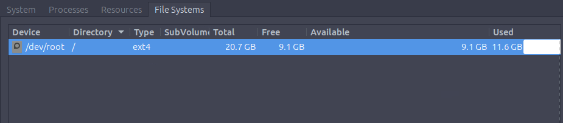

# Tryhackme_0724

## GB與GiB的差別

這禮拜看的一些資料還有別人整理的簡報都有提到MiB，起初以為是MB誤寫，查了才知道確實有這個用法。

| 單位 | 計算方式 | Bytes |
| :-- | :-- | :-- |
| 1GB  | 10003 | 1,000,000,000 Bytes |
| 1GiB | 10243 | 1,073,741,824 Bytes |

在 SI 制(十進位)，也就是我們日常生活常用的國際單位制，主要用在硬碟廠商、網路頻寬，因為它跟十進制的計算方式一致，便於計算、數字比較好看。

1 KB = 1,000 Bytes
1 MB = 1,000,000 Bytes
1 GB = 1,000,000,000 Bytes

而電腦實際運算時習慣用 2 的次方(二進位)，於是產生了由 IEC（國際電工委員會）定義的二進制單位：

1 KiB = 1,024 Bytes
1 MiB = 1,024 KiB = 1,048,576 Bytes
1 GiB = 1,024 MiB = 1,073,741,824 Bytes

簡單理解
MB：十進位，常見於硬碟、網路速度、檔案大小標示
MiB：二進位，常見於作業系統、記憶體、技術文件

這兩種都是精確定義的單位，所以沒有誰比較精準的問題。只要注意單位標示正確即可。

---

## 甚麼是ext4

資料出處 : [ext4](https://zh.wikipedia.org/zh-tw/Ext4 "游標顯示")、[日誌檔案系統](https://zh.wikipedia.org/wiki/%E6%97%A5%E5%BF%97%E6%96%87%E4%BB%B6%E7%B3%BB%E7%BB%9F "游標顯示")

在寫Operating Systems: Introduction的task3時，有題的答案是**ext4**，好奇心作祟下就又花了點時間去查了一下。

**ext4** (第四代延伸檔案系統) : Linux 使用的日誌檔案系統，也是 ext3 的後繼版本。它在 2000 年代後期成為穩定版本，並加入 Linux 核心。

那麼有第四代肯定也會有前面幾代 ， 其中演進關係為ext → ext2 → ext3 → ext4。
其中 :
ext2 沒有日誌功能。
ext3 加入日誌功能。
ext4 在 ext3 的基礎上增加容量、效能及可靠性方面的改進

---

#### 甚麼是Journaling file system (日誌檔案系統)

它的特色是在正式修改主要檔案系統之前，先將即將進行的變更記錄在一個稱為 journal（日誌） 的區域。這能降低系統當機、核心崩潰或突然斷電時，檔案系統進入不一致狀態的風險。

---

#### 為什麼需要日誌

修改一個檔案通常不是只有一個動作，而是由多個步驟組成。

例如刪除檔案時，系統可能需要：

1. 從資料夾中移除檔案名稱。
2. 修改檔案的相關資訊。
3. 釋放檔案占用的磁碟空間。

假設系統完成第一個步驟後突然斷電，檔案名稱可能已經消失，但它占用的磁碟空間還沒有被釋放。此時作業系統找不到檔案，卻仍然認為那一部分空間正在使用，造成檔案系統資料不一致。

沒有日誌功能時，系統可能需要檢查整個檔案系統才能找出並修復問題。

---

#### 日誌的恢復方式

系統發生故障後，只要讀取日誌重新執行未完成的操作，檔案系統就可以恢復一致。

日誌中可能出現以下情況：

| 情況 | 處理方式 |
| :-- | :-- |
| 操作已完成 | 不需要重新執行 |
| 日誌完整但操作未完成 | 根據日誌重新執行 |
| 操作無法完成 | 撤銷這次操作 |
| 日誌本身不完整 | 忽略這筆操作 |

---

#### 日誌的三種模式

日誌檔案系統通常可以用不同方式處理「檔案內容」與「中繼資料」。

中繼資料 (Metadata) : 中繼資料不是檔案的實際內容，而是描述檔案的資訊(檔名、檔案大小、檔案儲存位置等等)

假設有一個文字檔：

`hello.txt`

它的內容是：

`Hello World`

其中：

Hello World 是檔案資料。
hello.txt 的名稱、大小和權限等是中繼資料。

---
Writeback 模式

Writeback 模式只會把中繼資料寫進 journal，檔案內容則直接寫入主要檔案系統。

中繼資料 → Journal
檔案內容 → 主要檔案系統

這種模式通常具有較好的效能，但如果檔案內容尚未完成寫入就發生當機，檔案中可能出現不正確或無效的資料。

---

Ordered 模式

Ordered 模式也只把中繼資料寫入 journal，但它會先確保檔案內容已經寫入主要檔案系統，再提交對應的中繼資料。

先寫入檔案內容
 ↓
再提交中繼資料

如果寫入途中發生故障，尚未完成的動作可以被取消，讓檔案維持原本的狀態。

---

Data 模式

Data 模式會將中繼資料和檔案內容都先寫進 journal，之後再寫入主要檔案系統。

中繼資料與檔案內容
↓
Journal
↓
主要檔案系統

這種模式提供更完整的日誌保護，但同一份資料可能需要寫入兩次，因此會產生較大的效能成本。

---

三種模式比較

| 模式 | Journal 記錄內容	| 效能 | 保護程度 |
| :-- | :-- | :-- | :-- |
| Writeback	| 只有中繼資料 | 較高 |	較低 |
| Ordered |	中繼資料，且先寫入檔案內容 | 平衡 | 中等 |
| Data | 中繼資料和檔案內容	| 較低 | 較高 |

---