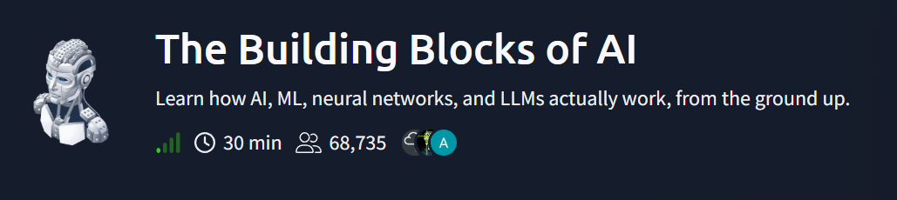

# AI 與神經網路基礎整理

讀到這篇時因為之前沒什麼接觸ai的東西，所以花了一些時間整理一下內容。


## 人工智慧是什麼？

人工智慧（Artificial Intelligence，AI）的主要目標是：

> 讓電腦能模仿人類的思考、判斷、學習和行為。

AI 並不是單一技術，而是一個很大的領域，其中包含：

* Machine Learning，機器學習
* Deep Learning，深度學習
* Neural Network，神經網路
* Natural Language Processing，自然語言處理
* Computer Vision，電腦視覺

神經網路是目前實現人工智慧的重要方法之一。

---

# 神經網路的概念

神經網路（Neural Network）的設計概念來自人類大腦。

人類大腦中有大量的神經元，神經元會透過突觸互相傳遞訊號。

## 生物學上的基本概念

* **Neuron（神經元）**：接收與傳遞訊號的細胞
* **Synapse（突觸）**：神經元之間傳遞訊號的連接位置

當人類反覆接觸某種事物時，大腦會調整神經元之間的連接強度。

例如，小孩看過很多次貓之後，會逐漸注意到：

* 尖耳朵
* 鬍鬚
* 四隻腳
* 尾巴
* 特定的臉部輪廓

經過多次觀察後，大腦就能辨認新的貓。

神經網路模仿的正是這種學習方式。

---

# 神經網路的三大結構

神經網路從位置上可以分成三大部分：

```text
輸入層 → 隱藏層 → 輸出層
Input    Hidden    Output
Layer    Layers    Layer
```

## 輸入層 Input Layer

輸入層負責接收原始資料。

輸入資料可能是：

* 圖片像素
* 文字
* 聲音
* 溫度
* 身高
* 體重
* 感測器資料

例如，一張 `4 × 4` 像素的灰階圖片共有：

```text
4 × 4 = 16 個像素
```

因此，可以使用 16 個輸入節點，每個節點接收一個像素值。


---

## 隱藏層 Hidden Layer

隱藏層位於輸入層與輸出層之間，主要負責：

* 分析輸入資料
* 找出資料特徵
* 組合簡單特徵
* 建立更複雜的判斷

例如，在辨識手寫數字時：

```text
像素
  ↓
邊緣與線條
  ↓
曲線與形狀
  ↓
數字的局部結構
  ↓
完整的數字特徵
```

較前面的隱藏層可能偵測：

* 水平線
* 垂直線
* 斜線
* 邊緣
* 曲線

較深的隱藏層會把這些簡單特徵組合起來。

例如：

```text
上方橫線 + 斜線 → 可能是數字 7
上下兩個圓圈   → 可能是數字 8
封閉的圓形     → 可能是數字 0
```

隱藏層可以只有一層，也可以有很多層。

```text
輸入層
  ↓
隱藏層 1
  ↓
隱藏層 2
  ↓
隱藏層 3
  ↓
輸出層
```

---

## 輸出層 Output Layer

輸出層負責產生最後的預測結果。

例如，辨識數字 `0～9` 時，輸出層可以有 10 個節點：

```text
0、1、2、3、4、5、6、7、8、9
```

每個節點代表圖片是該數字的可能性。

例如：

| 數字 | 預測分數 |
| -- | ---: |
| 0  | 0.02 |
| 1  | 0.03 |
| 2  | 0.01 |
| 3  | 0.04 |
| 4  | 0.01 |
| 5  | 0.02 |
| 6  | 0.01 |
| 7  | 0.82 |
| 8  | 0.03 |
| 9  | 0.01 |

因為數字 7 的分數最高，所以模型預測：

```text
這張圖片是數字 7
```

---

# 神經網路還有其他層嗎？

從位置上來看，神經網路主要就是：

1. 輸入層
2. 隱藏層
3. 輸出層

但是隱藏層可以使用很多不同功能的層。

常見的層包括：

| 層的名稱                  | 主要功能             |
| --------------------- | ---------------- |
| Dense Layer           | 綜合所有輸入資訊         |
| Fully Connected Layer | 每個神經元都與上一層連接     |
| Convolutional Layer   | 偵測圖片的線條、邊緣和形狀    |
| Pooling Layer         | 縮小資料並保留重要特徵      |
| Activation Layer      | 讓模型可以學習複雜的非線性規律  |
| Dropout Layer         | 隨機關閉部分神經元，降低過度擬合 |
| Normalization Layer   | 讓訓練過程更穩定         |
| Recurrent Layer       | 處理句子、聲音或時間序列     |
| Attention Layer       | 判斷輸入資料中哪些部分最重要   |

例如，圖片辨識模型可能是：

```text
圖片輸入
  ↓
卷積層：找邊緣
  ↓
卷積層：找曲線和形狀
  ↓
池化層：縮小資料
  ↓
全連接層：整合特徵
  ↓
輸出層：判斷圖片內容
```

因此可以這樣記：

> 輸入層、隱藏層和輸出層是在描述「位置」；卷積層、池化層和注意力層是在描述「功能」。

---

# 權重 Weight

權重（Weight）是神經網路中非常重要的數值。

權重代表：

> 某個輸入訊號對下一個神經元有多大的影響。

每一條神經元之間的連線，通常都有自己的權重。

要注意：

> 權重通常位於神經元之間的連線上，而不是單獨放在神經元中。

---

## 權重如何計算？

假設神經元收到三個輸入：

```text
x₁ = 1
x₂ = 0.5
x₃ = 2
```

對應的權重為：

```text
w₁ = 0.8
w₂ = 0.2
w₃ = -0.5
```

神經元會把輸入乘上對應權重，再全部加起來：

```text
x₁w₁ + x₂w₂ + x₃w₃
```

代入數值：

```text
(1 × 0.8) + (0.5 × 0.2) + (2 × -0.5)
```

```text
= 0.8 + 0.1 - 1
= -0.1
```

最後得到的 `-0.1` 稱為加權總和。

---

## 正權重、負權重與零權重

### 正權重

正權重表示這個特徵會支持某個判斷。

例如，辨識數字 1：

```text
垂直線 → 權重 +0.9
```

圖片中垂直線越明顯，「這是數字 1」的分數可能越高。

### 負權重

負權重表示這個特徵會反對某個判斷。

例如：

```text
封閉圓形 → 權重 -0.8
```

因為數字 1 通常沒有封閉圓形，所以這個特徵會降低數字 1 的分數。

### 接近零的權重

接近零的權重表示：

> 這個特徵對目前判斷幾乎沒有影響。

例如：

```text
圖片角落的小雜點 → 權重 0.01
```

---

## 權重的大小與方向

權重包含兩個重要資訊：

1. **正負號**：表示支持或反對
2. **數值大小**：表示影響程度

例如：

|     權重 | 意義     |
| -----: | ------ |
|  `0.9` | 強烈支持   |
|  `0.2` | 稍微支持   |
| `0.01` | 幾乎沒有影響 |
| `-0.3` | 稍微反對   |
| `-0.9` | 強烈反對   |

因此，權重不只是「重要程度」，也表示影響的方向。

---

# Bias 偏差值

除了權重以外，神經元通常還有一個偏差值（Bias）。

完整的計算形式是：

```text
z = x₁w₁ + x₂w₂ + x₃w₃ + b
```

其中：

| 符號  | 意義     |
| --- | ------ |
| `x` | 輸入值    |
| `w` | 權重     |
| `b` | 偏差值    |
| `z` | 加權計算結果 |

Bias 可以理解成：

> 神經元的基本門檻調整值。

例如，某個神經元原本需要很強的訊號才會被啟動，Bias 可以讓它更容易或更不容易啟動。

---

# 啟動函數 Activation Function

神經元計算出加權總和後，通常還會經過啟動函數。

完整流程如下：

```text
輸入資料
  ↓
輸入乘上權重
  ↓
全部相加，再加上 Bias
  ↓
經過啟動函數
  ↓
傳給下一層
```

啟動函數的功能是讓神經網路能學習複雜的非線性關係。

如果完全沒有啟動函數，即使神經網路有很多層，整體仍可能只相當於一個簡單的線性計算。

---

# 神經網路如何學習？

神經網路一開始並不知道正確的權重。

權重通常會先被設定成一些隨機值，例如：

```text
0.12、-0.47、0.03、0.81
```

接著，模型會使用訓練資料進行預測。

例如：

```text
正確答案：7
模型預測：1
```

模型發現答案錯誤後，會計算誤差，再調整權重。

```text
輸入訓練資料
  ↓
模型產生預測
  ↓
和正確答案比較
  ↓
計算誤差
  ↓
調整權重與 Bias
  ↓
再次預測
```

經過大量重複訓練後，模型的誤差通常會逐漸降低。

因此，神經網路的學習本質上就是：

> 不斷調整大量權重與 Bias，讓預測結果更接近正確答案。

---

# 反向傳播 Backpropagation

當預測錯誤時，神經網路需要知道哪些權重應該調整。

這個過程稱為：

> Backpropagation，反向傳播。

反向傳播會從輸出層開始，逐層往前檢查錯誤的來源。

概念流程如下：

```text
輸出錯了多少？
  ↓
最後一層的權重造成多少影響？
  ↓
前一層的權重造成多少影響？
  ↓
逐層往回計算
  ↓
調整每一個權重
```

通常每次只會調整一小部分，而不是一次大幅改變。

---

# 學習率 Learning Rate

學習率決定每一次要調整多少權重。

例如原本的權重是：

```text
0.50
```

模型發現這個權重需要增加。

較小的學習率可能讓它變成：

```text
0.50 → 0.51
```

較大的學習率可能讓它變成：

```text
0.50 → 1.50
```

## 學習率太大

可能造成：

* 權重改變太劇烈
* 錯過最佳答案
* 訓練結果不穩定
* 誤差上下震盪

## 學習率太小

可能造成：

* 訓練速度非常慢
* 需要更多訓練次數
* 花費更多運算時間

所以學習率需要選擇適當的大小。

---

# Deep Learning 深度學習

深度學習（Deep Learning，DL）通常是指具有多個隱藏層的神經網路。

```text
普通神經網路：

輸入層 → 隱藏層 → 輸出層
```

```text
深度神經網路：

輸入層
  ↓
隱藏層 1
  ↓
隱藏層 2
  ↓
隱藏層 3
  ↓
更多隱藏層
  ↓
輸出層
```

「Deep」指的是神經網路有較深、較多的處理層，而不是表示電腦真的像人類一樣進行深度思考。

---

# Machine Learning 與 Deep Learning 的差別

| Machine Learning | Deep Learning |
| ---------------- | ------------- |
| 中文為機器學習          | 中文為深度學習       |
| 通常使用較簡單的模型       | 使用多層神經網路      |
| 經常需要人工挑選特徵       | 可以自動學習特徵      |
| 適合較小或結構化資料       | 適合大量且複雜的資料    |
| 所需運算量通常較低        | 所需運算量通常較高     |
| 模型通常較容易解釋        | 模型通常較難解釋      |

例如，傳統機器學習在辨識數字前，人類可能要先提供：

* 線條數量
* 圓圈數量
* 圖形寬度
* 圖形高度
* 邊緣方向

深度學習則可以直接接收圖片像素，自動找出哪些特徵最重要。

---

## 深度學習是否不需要標記資料？

「深度學習完全不需要標記資料」這個說法並不準確。

很多深度學習模型仍然需要標記資料。

例如：

```text
圖片：手寫數字 7
正確標籤：7
```

比較正確的說法是：

> 深度學習通常不需要人類手動設計特徵，但不代表完全不需要標記資料。

有些深度學習方法可以使用未標記資料，例如：

* Unsupervised Learning
* Self-supervised Learning
* Autoencoder

但監督式深度學習仍然需要正確答案或標籤。

---

# Overfitting 過度擬合

Overfitting 中文稱為：

> 過度擬合。

意思是：

> 模型把訓練資料記得太熟，甚至連雜訊和偶然出現的細節都記住，導致遇到新資料時表現變差。

簡單來說就是：

> 死背答案，而不是真的理解規則。

---

## 辨識貓的例子

假設所有訓練圖片中的貓剛好都有：

* 白色背景
* 戴著項圈
* 面向右邊

正常的模型應該學習：

* 尖耳朵
* 鬍鬚
* 貓臉形狀
* 身體輪廓

但過度擬合的模型可能學到：

```text
白色背景 + 項圈 + 面向右邊 = 貓
```

當它看到黑色背景、沒有項圈的貓時，就可能無法辨認。

---

## Overfitting 的典型現象

| 資料類型            | 模型表現  |
| --------------- | ----- |
| Training Data   | 表現非常好 |
| Validation Data | 表現較差  |
| Test Data       | 表現較差  |

例如：

```text
訓練準確率：99%
測試準確率：70%
```

兩者差距很大，可能表示模型發生 Overfitting。

---

# 為什麼會發生 Overfitting？

## 訓練資料太少

如果模型只看過很少的資料，就不容易理解普遍規律。

例如模型只看過：

```text
白色貓
白色貓
白色貓
```

它可能錯誤地認為：

```text
所有貓都是白色的
```

---

## 訓練資料不夠多樣

例如人臉模型只看過：

* 正面照片
* 白天拍攝
* 光線充足
* 相同拍攝角度

遇到側臉、夜晚或昏暗環境時，模型就可能判斷錯誤。

---

## 訓練太久

訓練初期，模型通常會學到有用規律。

但是訓練太久後，模型可能開始記住：

* 圖片雜點
* 背景顏色
* 特定拍攝角度
* 訓練資料中的錯誤
* 偶然出現的小細節

因此，訓練資料的表現繼續變好，但新資料的表現反而下降。

---

## 模型太複雜

模型越複雜，通常代表：

* 隱藏層較多
* 神經元較多
* 權重較多
* 可以記住更複雜的資料

如果資料很少，但模型擁有大量權重，就可能直接記住每一筆訓練資料。

---

# 為什麼降低模型複雜度？

降低模型複雜度的目的不是單純讓模型變差，而是：

> 限制模型死背訓練資料的能力，迫使它學習比較通用的規律。

假設只有 100 筆訓練資料。

## 模型只有 10 個權重

因為能力有限，它比較難記住每一筆資料的所有細節，只能尋找較明顯的共同規律。

## 模型有 1,000,000 個權重

它可能有足夠的能力記住：

* 每張圖片的位置
* 每張圖片的背景
* 每張圖片的雜點
* 每張圖片的特殊細節

這些細節不一定能套用到新資料。

---

## 簡單模型與複雜模型

假設資料大致呈現直線趨勢。

簡單模型可能學到：

```text
y = 2x + 1
```

它不一定完全通過每一個資料點，但能掌握整體趨勢。

複雜模型可能畫出一條彎來彎去的曲線，努力通過每一個訓練資料點。

這代表它連資料中的隨機誤差都學進去了。

結果可能是：

* 對訓練資料非常準
* 對新資料反而不準

---

# 模型是否越簡單越好？

不是。

如果模型太簡單，它可能連真正的規律都學不會，這稱為：

> Underfitting，欠擬合。

可以這樣比較：

| 狀態           | 說明               |
| ------------ | ---------------- |
| Underfitting | 模型太簡單，連訓練資料都學不好  |
| Good Fit     | 模型學到可以通用的規律      |
| Overfitting  | 模型記住訓練資料，但新資料表現差 |

例如：

## Underfitting

```text
訓練準確率：60%
測試準確率：58%
```

代表模型連訓練資料都沒有學好。

## 正常擬合

```text
訓練準確率：92%
測試準確率：89%
```

代表模型能把學到的規律應用在新資料。

## Overfitting

```text
訓練準確率：99%
測試準確率：70%
```

代表模型可能只是記住訓練資料。

可以簡單記成：

```text
Underfitting：沒有學會
Good Fit：真正理解
Overfitting：死背答案
```

因此，模型不是越簡單越好，也不是越複雜越好。

正確目標是：

> 讓模型複雜度符合資料量與問題難度。

---

# 如何降低 Overfitting？

## 增加訓練資料

資料越多、種類越豐富，模型越不容易記住個別樣本。

例如辨識貓時，訓練資料應包含：

* 不同顏色的貓
* 不同品種的貓
* 不同背景
* 不同角度
* 不同光線
* 不同大小

---

## Data Augmentation 資料增強

將原本資料稍微修改，產生更多訓練範例。

圖片常見的資料增強方式包括：

* 旋轉
* 縮放
* 裁切
* 左右翻轉
* 改變亮度
* 加入少量雜訊

這可以讓模型理解：

> 即使角度、大小或亮度不同，它仍然是同一類物體。

---

## Dropout

Dropout 會在訓練期間隨機關閉部分神經元。

例如：

```text
原本：

A → B → C → 輸出
```

某次訓練可能暫時變成：

```text
A → X → C → 輸出
```

下一次又可能關閉其他神經元。

這樣可以避免模型過度依賴少數特定神經元或固定路線。

---

## Early Stopping

Early Stopping 中文可稱為提前停止。

訓練過程中同時觀察：

* 訓練資料的誤差
* 驗證資料的誤差

可能出現以下情況：

```text
訓練誤差：持續下降
驗證誤差：先下降，後來開始上升
```

當驗證誤差開始上升時，表示模型可能開始過度擬合，此時可以停止訓練。

---

## 降低模型複雜度

可以採用：

* 減少隱藏層數量
* 減少每一層的神經元
* 減少參數數量
* 使用較簡單的模型

但前提是模型確實發生 Overfitting。

如果連訓練資料都學不好，就不應繼續降低複雜度。

---

## Regularization 正則化

正則化會對過大或過度複雜的權重加入額外懲罰。

例如模型原本想把某個權重調整成：

```text
w = 100
```

加入正則化後，模型會傾向使用較小、較平均的權重。

這樣可以降低模型對單一特徵的過度依賴。

---

# 神經網路完整流程

```text
輸入原始資料
  ↓
輸入層接收資料
  ↓
每個輸入乘上權重
  ↓
計算加權總和並加上 Bias
  ↓
通過啟動函數
  ↓
隱藏層逐層提取特徵
  ↓
輸出層產生預測
  ↓
與正確答案比較
  ↓
計算誤差
  ↓
使用反向傳播調整權重
  ↓
重複訓練
```

---

# 心得

> 神經網路透過輸入資料、權重、Bias 和多層特徵處理產生預測，並利用預測誤差反覆調整權重；訓練時必須避免模型過於簡單而學不會，也要避免模型過於複雜而只會死背訓練資料。
